<!-- Hero Section -->
<div align="center">


<br><br>


<br>

**Personal portfolio showcasing my projects, skills, and professional journey**

[✨ Features](#-features) • [🏗️ Architecture](#️-architecture) • [🚀 Quick Start](#-quick-start) • [🎨 Components](#-components)

</div>

---


<!-- About -->
## 💼 **About**

<table>
<tr>
<td width="60%">

### 🎯 **The Portfolio**

A **modern, responsive portfolio** built with React and Vite, showcasing my development journey, technical skills, and projects.

Designed with a focus on:
- Clean, professional aesthetics
- Smooth animations and interactions
- Mobile-first responsive design
- Fast performance and loading times
- Accessible and SEO-friendly structure

**Purpose:** Present my work in a compelling way that reflects both my technical abilities and design sensibility.

</td>
<td width="40%">


</td>
</tr>
</table>


<!-- Features -->
## ✨ **Features**

<div align="center">

### **Complete Portfolio Experience**

</div>

<table>
<tr>
<td width="50%">

### 🎨 **Visual Design**

- 🌊 **Smooth Animations**: Scroll-triggered reveals
- 🎯 **Interactive Elements**: Hover effects & transitions
- 📱 **Responsive Layout**: Mobile-first approach
- 🎭 **Modern UI**: Clean, professional aesthetics
- ⚡ **Performance**: Optimized rendering
- 🌈 **Color Scheme**: Consistent brand colors

</td>
<td width="50%">

### 🚀 **User Experience**

- 📜 **Smooth Scrolling**: Seamless navigation
- 🎪 **Staggered Animations**: Progressive content reveal
- 📊 **CountUp Effects**: Animated statistics
- 🔗 **Quick Navigation**: Header menu with active states
- 📬 **Contact Form**: Easy communication
- 🎯 **CTA Buttons**: Clear call-to-actions

</td>
</tr>
</table>

### 📄 **Portfolio Sections**

<div align="center">

| Section | Purpose | Features |
|---------|---------|----------|
| **Hero** | First impression & introduction | Animated entrance, professional photo, tagline |
| **About** | Personal background & story | Bio, values, downloadable resume |
| **Skills** | Technical competencies | Skill categories, proficiency levels |
| **Timeline** | Career & education journey | Chronological events, milestones |
| **Projects** | Portfolio showcase | Project cards, descriptions, tech stack, links |
| **Contact** | Get in touch | Contact form, social links, email |

</div>


<!-- Technologies -->
## 🛠️ **Technologies**

<div align="center">

### **Modern React Stack**

<table>
<tr>
<td align="center" width="33%">

### ⚛️ **React**


**React 18.3**  
Functional components & hooks

</td>
<td align="center" width="33%">

### ⚡ **Vite**


**Vite 5.4**  
Lightning-fast HMR

</td>
<td align="center" width="33%">

### 🎨 **CSS3**


**Modern CSS**  
Animations & responsiveness

</td>
</tr>
</table>

### 📦 **Development Tools**


</div>

### 🔧 **Key Libraries & Features**

- **React Hooks**: useState, useEffect, useRef
- **Custom Hooks**: useScrollReveal for animations
- **CSS Modules**: Scoped styling per component
- **Intersection Observer**: Scroll-triggered animations
- **CountUp Animation**: Smooth number animations
- **Responsive Design**: Mobile, tablet, desktop breakpoints


<!-- Architecture -->
## 🏗️ **Architecture**

<div align="center">

### **Component Structure**

```mermaid
graph TD
    A[📱 App.jsx] -->|Layout| B[🎯 Header]
    A -->|Sections| C[🏠 Hero]
    A -->|Sections| D[👤 About]
    A -->|Sections| E[💼 Skills]
    A -->|Sections| F[📅 Timeline]
    A -->|Sections| G[🚀 Projects]
    A -->|Sections| H[📬 Contact]
    A -->|Layout| I[🔗 Footer]
    
    B -->|Menu| J[🎪 StaggeredMenu]
    
    style A fill:#61DAFB,stroke:#1a1a1a,color:#000
    style B fill:#3B82F6,stroke:#1a1a1a,color:#fff
    style J fill:#8B5CF6,stroke:#1a1a1a,color:#fff
```



</div>

### 📁 **Project Structure**

```
📦 joaogalimberti-portfolio/
 ┃
 ┣ 📂 src/
 ┃ ┣ 📄 App.jsx                  ← Main application component
 ┃ ┣ 📄 main.jsx                 ← Entry point
 ┃ ┃
 ┃ ┣ 📂 components/
 ┃ ┃ ┣ 📄 Hero.jsx               ← Landing section
 ┃ ┃ ┣ 📄 About.jsx              ← About me section
 ┃ ┃ ┣ 📄 Skills.jsx             ← Technical skills
 ┃ ┃ ┣ 📄 Timeline.jsx           ← Career timeline
 ┃ ┃ ┣ 📄 Projects.jsx           ← Portfolio projects
 ┃ ┃ ┣ 📄 Contact.jsx            ← Contact form
 ┃ ┃ ┣ 📄 Footer.jsx             ← Footer section
 ┃ ┃ ┣ 📄 CountUp.jsx            ← Animated counter
 ┃ ┃ ┃
 ┃ ┃ ┗ 📂 Header/
 ┃ ┃   ┣ 📄 Header.jsx           ← Navigation header
 ┃ ┃   ┣ 📄 StaggeredMenu.jsx   ← Mobile menu
 ┃ ┃   ┗ 🎨 StaggeredMenu.css   ← Menu styles
 ┃ ┃
 ┃ ┣ 📂 hooks/
 ┃ ┃ ┗ 📄 useScrollReveal.js    ← Scroll animation hook
 ┃ ┃
 ┃ ┗ 📂 styles/
 ┃   ┗ 🎨 global.css             ← Global styles
 ┃
 ┣ 📄 index.html                 ← HTML template
 ┣ 📄 vite.config.js             ← Vite configuration
 ┣ 📄 eslint.config.js           ← ESLint rules
 ┣ 📄 package.json               ← Dependencies
 ┗ 📖 README.md                  ← Documentation
```


<!-- Components -->
## 🎨 **Components**

### 🧩 **Core Components**

<table>
<tr>
<td width="50%">

#### **Hero**
- Full-screen landing section
- Animated introduction
- Professional photo
- Call-to-action buttons
- Scroll indicator

#### **About**
- Personal introduction
- Professional background
- Core values
- Resume download

#### **Skills**
- Technical skills showcase
- Skill categories
- Proficiency indicators
- Technology icons

</td>
<td width="50%">

#### **Timeline**
- Career milestones
- Education history
- Chronological layout
- Animated transitions

#### **Projects**
- Portfolio showcase
- Project cards with images
- Tech stack tags
- Live demo & GitHub links

#### **Contact**
- Contact form
- Social media links
- Email integration
- Form validation

</td>
</tr>
</table>

### 🎯 **Special Features**

#### **CountUp Component**
Animated number counter with:
- Smooth counting animation
- Configurable duration
- Intersection Observer trigger
- Support for decimals

#### **useScrollReveal Hook**
Custom hook for scroll animations:
- Intersection Observer API
- Configurable thresholds
- Smooth reveal animations
- Reusable across components

#### **StaggeredMenu**
Mobile navigation with:
- Hamburger animation
- Staggered item reveals
- Smooth transitions
- Touch-friendly interactions


<!-- Quick Start -->
## 🚀 **Quick Start**

<div align="center">

### **Get Started in 3 Steps**

</div>

<table>
<tr>
<td width="33%" align="center">

### 1️⃣ **Clone**

```bash
git clone https://github.com/
joaogalimberti/
portfolio.git

cd portfolio
```


</td>
<td width="33%" align="center">

### 2️⃣ **Install**

```bash
npm install
```


</td>
<td width="33%" align="center">

### 3️⃣ **Run**

```bash
npm run dev
```


</td>
</tr>
</table>

<div align="center">

**🌐 Open** → `http://localhost:5173`

</div>

### 📋 **Available Commands**

<table>
<tr>
<th>Command</th>
<th>Action</th>
</tr>
<tr>
<td><code>npm run dev</code></td>
<td>Start development server with HMR</td>
</tr>
<tr>
<td><code>npm run build</code></td>
<td>Build for production (optimized bundle)</td>
</tr>
<tr>
<td><code>npm run preview</code></td>
<td>Preview production build locally</td>
</tr>
<tr>
<td><code>npm run lint</code></td>
<td>Run ESLint for code quality</td>
</tr>
</table>


<!-- Design System -->
## 🎨 **Design System**

### 🎨 **Animation Patterns**

<table>
<tr>
<td width="50%">

#### **Scroll Reveal**
```javascript
// Fade in from bottom
opacity: 0 → 1
transform: translateY(20px) → translateY(0)
duration: 0.6s ease
```

#### **Stagger Effect**
```javascript
// Sequential reveals
delay: index * 100ms
each item appears 100ms after previous
creates wave effect
```

</td>
<td width="50%">

#### **CountUp Animation**
```javascript
// Number animation
from: 0
to: target value
duration: 2s
easing: ease-out
```

#### **Hover Effects**
```javascript
// Interactive feedback
transform: scale(1.05)
box-shadow: elevated
transition: 0.3s ease
```

</td>
</tr>
</table>

### 📱 **Responsive Breakpoints**

<div align="center">

| Device | Breakpoint | Layout |
|--------|-----------|---------|
| **Mobile** | < 640px | Single column, stacked |
| **Tablet** | 640px - 1024px | Two columns, adjusted spacing |
| **Desktop** | > 1024px | Full layout, multi-column |

</div>


<!-- Performance -->
## ⚡ **Performance**

<div align="center">

### **Optimized for Speed**

| Metric | Target | Status |
|--------|--------|--------|
| **First Contentful Paint** | < 1.5s | ✅ |
| **Time to Interactive** | < 3.5s | ✅ |
| **Lighthouse Score** | 90+ | ✅ |
| **Bundle Size** | < 150KB | ✅ |

### **Optimization Techniques**

</div>

- ✅ Code splitting with React.lazy
- ✅ Optimized images and assets
- ✅ Intersection Observer for lazy loading
- ✅ CSS animations (GPU accelerated)
- ✅ Minimal JavaScript bundle
- ✅ Vite's optimized build process


<!-- Customization -->
## 🔧 **Customization**

### 📝 **How to Personalize**

<table>
<tr>
<td width="50%">

#### **Content Updates**
1. **Personal Info**: Edit in `Hero.jsx`
2. **About Section**: Modify `About.jsx`
3. **Skills**: Update skills array in `Skills.jsx`
4. **Projects**: Add projects in `Projects.jsx`
5. **Timeline**: Edit events in `Timeline.jsx`

</td>
<td width="50%">

#### **Styling Changes**
1. **Colors**: Update CSS variables in `global.css`
2. **Fonts**: Modify font imports in `index.html`
3. **Animations**: Adjust timing in component styles
4. **Layout**: Modify component JSX structure

</td>
</tr>
</table>


<!-- Deployment -->
## 🌐 **Deployment**

<div align="center">

### **Deploy to Production**

</div>

### 🚀 **Deployment Options**

<table>
<tr>
<th>Platform</th>
<th>Command</th>
<th>Auto Deploy</th>
</tr>
<tr>
<td><b>Vercel</b></td>
<td><code>vercel</code></td>
<td>✅ Git integration</td>
</tr>
<tr>
<td><b>Netlify</b></td>
<td><code>netlify deploy</code></td>
<td>✅ Git integration</td>
</tr>
<tr>
<td><b>GitHub Pages</b></td>
<td><code>npm run build</code> + push to gh-pages</td>
<td>✅ GitHub Actions</td>
</tr>
</table>

### 📦 **Build Process**

```bash
# 1. Build optimized bundle
npm run build

# 2. Output goes to /dist folder

# 3. Deploy /dist to your hosting platform
```


<!-- Contact -->
## 📬 **Contact**

<div align="center">

### **Let's Connect!**

[](mailto:joaogalimberti@gmail.com)
[](https://www.linkedin.com/in/joaogalimberti/)
[](https://github.com/joaogalimberti)

</div>

---

<div align="center">


**Crafted with 💙 by [João Galimberti](https://github.com/joaogalimberti) | 2024**

*My professional story, told through modern web development*

</div>
